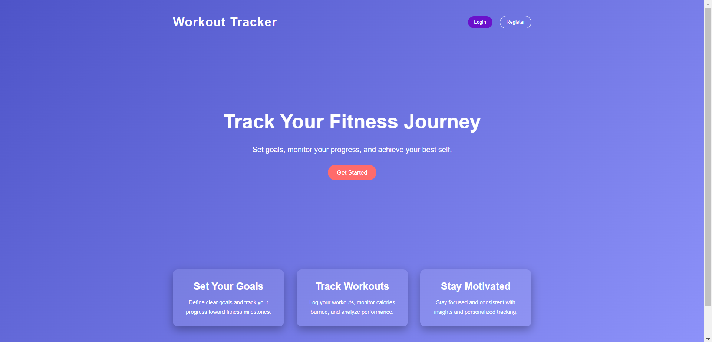
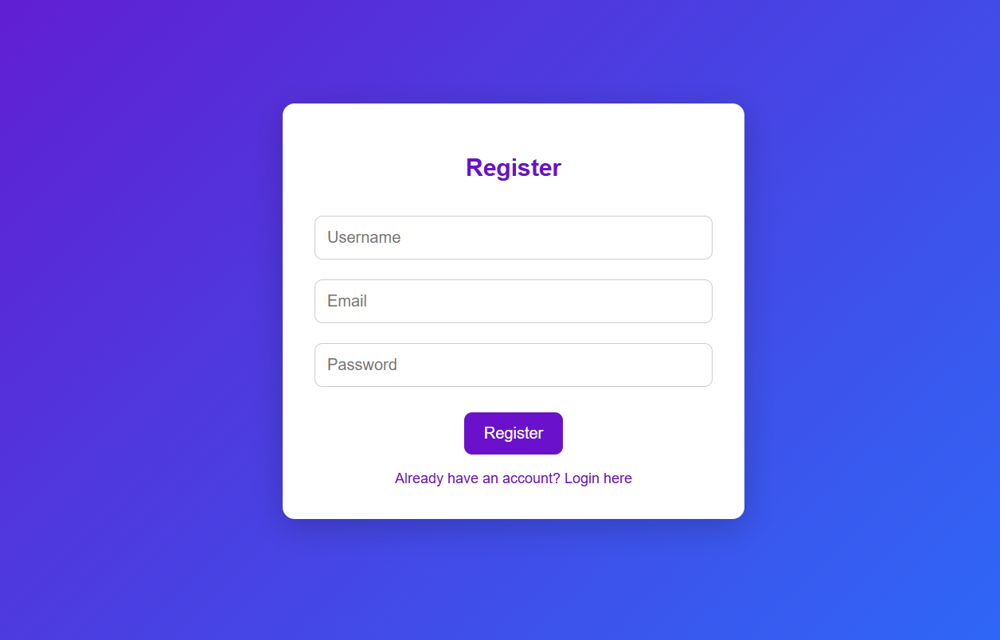
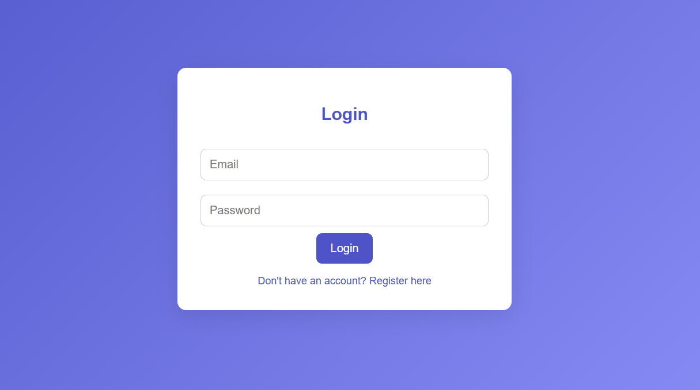
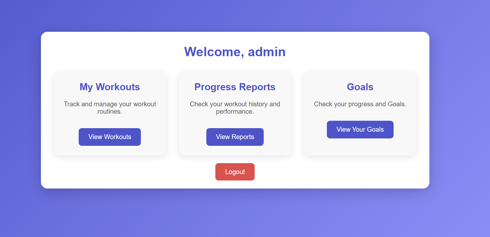
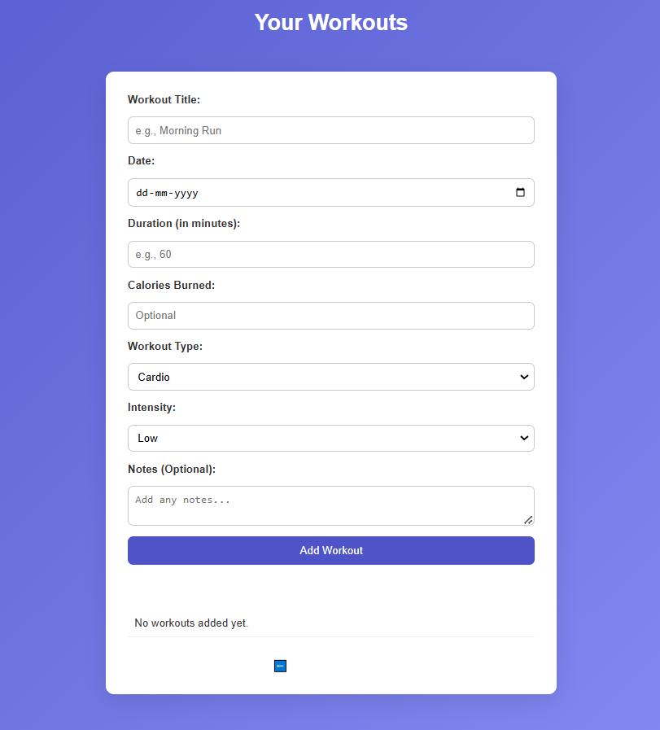
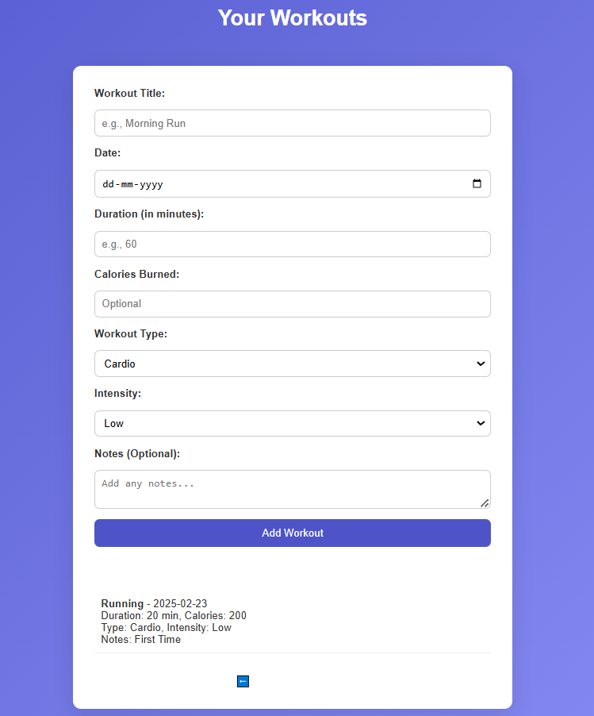
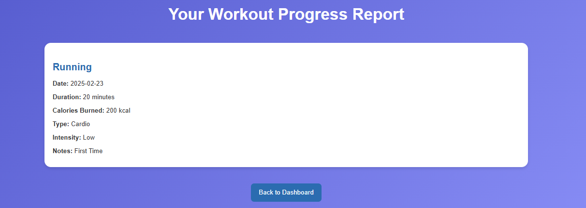
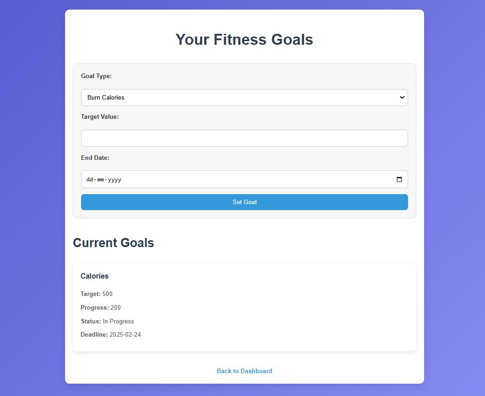

# 🏋️ Workout Tracker

A web-based fitness tracking application where users can set fitness goals, log their workouts, and monitor their progress. Built with Flask, SQLAlchemy, and JWT authentication.

## 📌 Features

✅ **User Authentication:**
   - Secure login and registration using Flask-JWT with cookies.

✅ **Workout Management:**
   - Add, view, and track your workout sessions.
   - Record essential workout data (duration, calories burned, intensity, etc.).

✅ **Goal Tracking:**
   - Set fitness goals (calories burned, workout duration, frequency).
   - Monitor progress and completion status.

✅ **Dashboard:**
   - View workout history and active goals.

✅ **Responsive Design:**
   - Works on desktops, tablets, and mobile devices.

## 🛠️ Tech Stack

- **Backend:** Flask (Python), Flask-JWT-Extended (for authentication)
- **Database:** SQLite (via SQLAlchemy)
- **Frontend:** HTML, CSS, JavaScript

---

## 📂 Project Structure

```

WORKOUT-TRACKER/.
├── .gitignore
├── app.py                 # Main Flask application entry point
├── database.py            # Database configuration and setup
├── LICENSE                # Project license
├── models.py              # SQLAlchemy models for Workout and Goals
├── README.md              # Project documentation
├── requirements.txt       # Project dependencies
├── routes.py              # Application routes (workouts, goals, auth)
│
├── static                 # Static files (CSS)
│   ├── dashboard.css
│   ├── goals.css
│   ├── login.css
│   ├── register.css
│   ├── report.css
│   └── styles.css
│
└── templates              # HTML templates
    ├── dashboard.html
    ├── goals.html
    ├── index.html
    ├── login.html
    ├── register.html
    ├── report.html
    └── workouts.html


## 🚀 Getting Started

### 1. Clone the Repository
```bash
git clone https://github.com/your-username/workout-tracker.git
cd workout-tracker
```

### 2. Create a Virtual Environment
```bash
python -m venv venv
source venv/bin/activate  # On Windows: venv\Scripts\activate
```

### 3. Install Dependencies
```bash
pip install -r requirements.txt
```

### 4. Set Up the Database
```bash
flask db init
flask db migrate -m "Initial migration."
flask db upgrade
```

### 5. Run the Application
```bash
flask run
```
Access the app at: `http://localhost:5000`

## 🔑 Environment Variables
Create a `.env` file to store your sensitive data:

```
SECRET_KEY=your_secret_key
JWT_SECRET_KEY=your_jwt_secret
DATABASE_URL=sqlite:///workout.db
```

## 📊 API Endpoints

| Endpoint               | Method | Description                  |
|------------------------|--------|------------------------------|
| `/`                    | GET    | Landing Page                 |
| `/register`            | POST   | User Registration            |
| `/login`               | POST   | User Login (JWT Cookies)     |
| `/workouts`            | GET    | Fetch User's Workouts        |
| `/workouts`            | POST   | Add a New Workout            |
| `/goals`               | GET    | View Current Goals           |
| `/goals`               | POST   | Set a New Fitness Goal       |

## 📸 Screenshots
















### 🏠 Landing Page
Beautiful and responsive landing page with clear navigation.

### 📊 Dashboard
Overview of user goals and recent workout activity.

### 🎯 Set Goals
Interactive form to add new fitness goals and track them.

## 📌 Future Enhancements

- Add workout analytics and charts.
- Email reminders for goal deadlines.
- User profile customization.

## 🧑‍💻 Contributing

Contributions are welcome! Feel free to open an issue or submit a pull request.

## 📄 License

This project is licensed under the **MIT License**.


